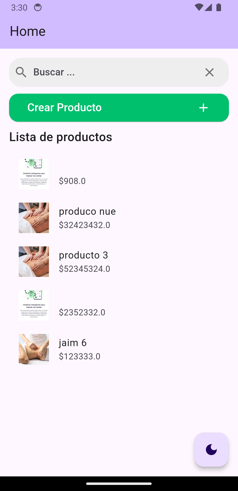
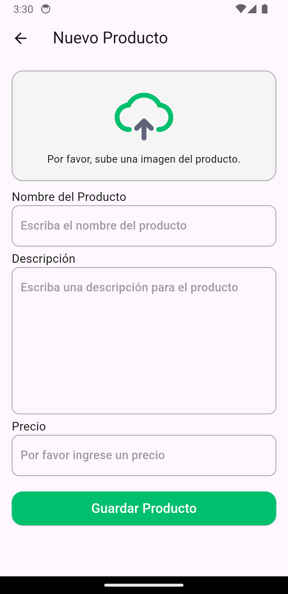

# Sysman Prueba Técnica

## Descripción del Proyecto

Esta aplicación es una solución para la prueba técnica de Sysman. Consiste en una aplicación móvil desarrollada en Flutter que permite gestionar un catálogo de productos. La aplicación incluye funcionalidades como listar productos, agregar nuevos productos, buscar productos por nombre y cambiar entre temas claro y oscuro.

## Capturas de Pantalla

Aquí tienes algunas capturas de pantalla del proyecto:




## Prototipo Figma

Aquí tienes el link del prototipo en Figma:

[https://www.figma.com/proto/JVGqO773NevLzffpC8xtTk/Untitled?node-id=0-1&t=aTw8FGRLTNDGWgNi-1](https://www.figma.com/proto/JVGqO773NevLzffpC8xtTk/Untitled?node-id=0-1&t=aTw8FGRLTNDGWgNi-1).

## Características Principales

- **Listado de Productos**: Visualización de todos los productos en una lista scrollable.
- **Creación de Productos**: Formulario para agregar nuevos productos con campos para nombre, descripción, precio e imagen.
- **Búsqueda de Productos**: Barra de búsqueda para filtrar productos por nombre en tiempo real.
- **Cambio de Tema**: Botón para alternar entre tema claro y oscuro.
- **Persistencia de Datos**: Uso de SQLite para almacenar localmente la información de los productos.

## Tecnologías Utilizadas

- Flutter
- Dart
- SQLite (sqflite package)
- image_picker (para selección de imágenes)

## Configuración del Proyecto

1. Asegúrate de tener Flutter instalado en tu sistema. Si no lo tienes, sigue las [instrucciones oficiales de instalación](https://flutter.dev/docs/get-started/install).

2. Clona este repositorio:

```bash
git clone https://github.com/jaimecalderon19/sysman-flutter-app.git
```
3. Clona este repositorio:

```bash
    cd sysman-flutter-app
```

4. Clona este repositorio:

```bash
    flutter pub get
```

5. Ejecuta la aplicación:

```bash
    flutter run
```

## Consideraciones Adicionales

- La aplicación utiliza SQLite para almacenamiento local, por lo que los datos persisten entre sesiones.
- Las imágenes de los productos se almacenan localmente en el dispositivo.
- La interfaz de usuario es responsiva y se adapta a diferentes tamaños de pantalla.